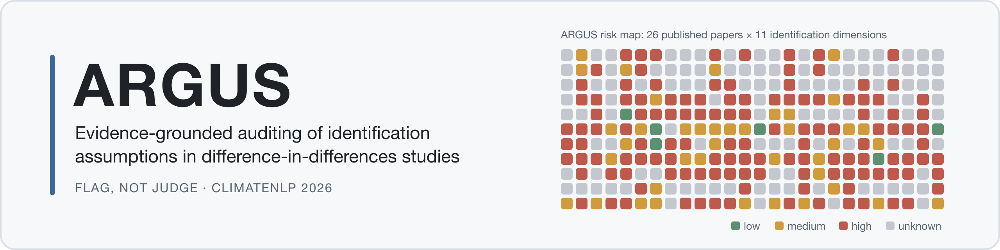
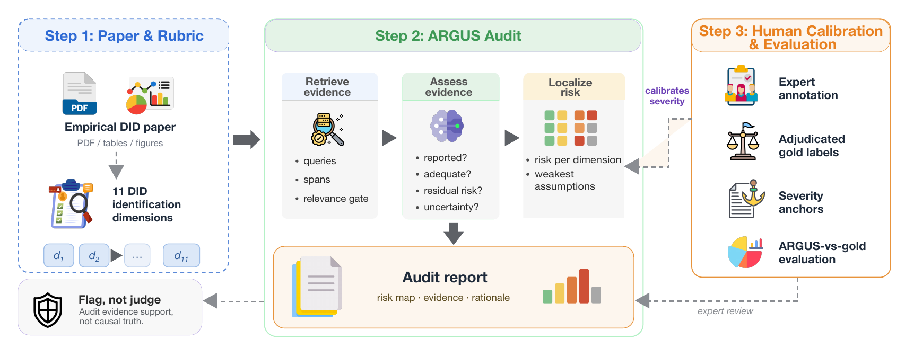
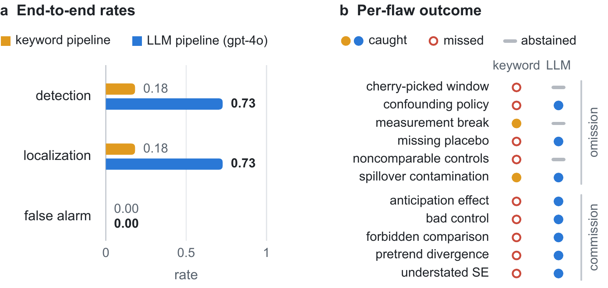
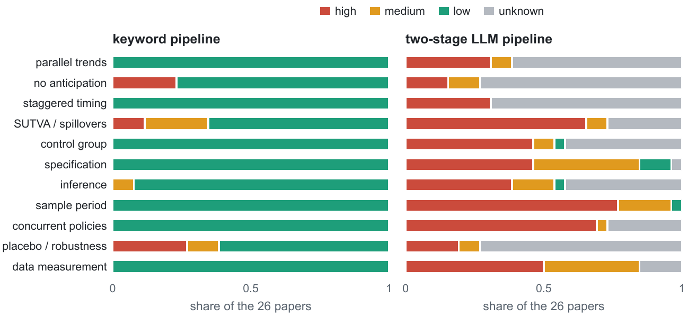

<p align="center">
  <picture>
    <source media="(prefers-color-scheme: dark)" srcset="docs/banner-dark.png">
    
  </picture>
</p>

<p align="center">
  <a href="paper_climatenlp/submissions/ClimateNLP2026_camera_ready.pdf"></a>
  <a href="LICENSE"></a>
  <a href="LICENSE-DATA.md"></a>
</p>

<p align="center">
  <a href="paper_climatenlp/submissions/ClimateNLP2026_camera_ready.pdf"><b>Paper</b></a> ·
  <a href="#headline-results">Results</a> ·
  <a href="#pipelines">Pipelines</a> ·
  <a href="#architecture">Architecture</a> ·
  <a href="#how-to-read-the-per-paper-judgements">Reading the labels</a> ·
  <a href="#quickstart">Quickstart</a> ·
  <a href="#citation">Citation</a>
</p>

# ARGUS

**Evidence-grounded auditing of identification assumptions in climate-policy causal evaluations.**

<sub>The banner matrix is real output: the two-stage pipeline's risk for each of the 26 published
DID papers (columns) on each of the 11 identification dimensions (rows); grey is an abstention.
It is regenerated from committed results by `docs/make_banner.py` and uses no third-party artwork.
Read the labels with the caveats under [How to read the per-paper judgements](#how-to-read-the-per-paper-judgements).</sub>

ARGUS audits the *causal identification credibility* of difference-in-differences (DID)
studies in environmental policy evaluation. (Every number reported in the paper comes from
the generic synthetic fixture `examples/papers/clean_supported.json`; the China emissions-trading
fixture in `examples/papers/` is an illustration and produced none of them.) It does **not** judge whether a paper's estimated effect is "true" — in a DID
design the counterfactual is never observed. Instead, ARGUS decomposes identification into
eleven auditable dimensions, gathers supporting evidence from the paper, assesses each
assumption→implication→evidence chain, localizes weaknesses, and produces a transparent
report that flags risks for a human expert. The system is validated through *synthetic flaw
injection*, which yields local ground truth for identification threats without requiring the
true causal effect.

<p align="center">
  
</p>

<sub>Figure 1 of the paper. Icons are from [Flaticon.com](https://www.flaticon.com) and are used
under the Flaticon free licence with attribution; they are third-party artwork and are not covered
by this repository's MIT or CC BY 4.0 licences.</sub>

> **Status:** accepted at **ClimateNLP 2026** (EMNLP workshop, Budapest, 28 Oct 2026);
> the camera-ready paper is `paper_climatenlp/` (PDF in `submissions/`). Camera-ready of
> 25 Sept 2026: the human-annotation pilot was re-run with two annotators under a
> pre-registered protocol (`annotation/human_pilot/PROTOCOL.md`); their gold is locked in
> `experiments/annotation/gold_final/` and replaces the labels of the reviewed version
> (`experiments/annotation/pilot_frozen/`, kept with a provenance note).
> The full two-stage LLM pipeline runs end-to-end: deterministic retrieval, a relevance
> gate with an explicit `unknown` abstention state, per-dimension adequacy assessment,
> risk localization, and report generation, evaluated on two flaw-injection benchmarks,
> a 26-paper real corpus, a cross-model panel, and a two-annotator human-gold pilot.

---

## Headline results

<p align="center">
  
</p>

**Flaw injection, 11 clear flaws** (gpt-4o; every row is an end-to-end pipeline with its own
evidence path: the keyword baseline scores paragraph chunks, the two-stage pipeline re-retrieves
and gates whole sections, and the other arms read the full paper, so the rows compare pipelines,
not a judgement policy over shared evidence):

| assessor | calls/paper | detection | false alarm | localization |
| --- | --- | --- | --- | --- |
| keyword baseline | 0 | 0.182 | 0.000 | 0.182 |
| full-paper single pass | 1 | 0.818 | 0.000 | 0.818 |
| per-dimension, no retrieval | 11 | 1.000 | 0.000 | 1.000 |
| two-stage ARGUS (retrieval + gate) | 22 | 0.727 | 0.000 | 0.727 |

The gated pipeline's misses are all *omission* flaws on which it **abstains rather than
guesses**; an oracle-retrieval ablation attributes every such miss to the gate, not the
judge (commission 0.86 / omission 1.00 when the assessor is fed the target section
directly), and the gate also suppresses the alarms section-level evidence alone triggers.

**Shared-evidence control** (pre-specified; `experiments/ablations/SHARED_EVIDENCE_PROTOCOL.md`,
results in `SHARED_EVIDENCE_RESULTS.md`). Because the rows above retrieve evidence differently,
a 2 x 2 control freezes the evidence and lets only the judgement policy vary, with no gate. Fed
the keyword pipeline's own chunks, the adequacy judge detects 10 of 11 flaws against the keyword
scorer's 2 (exact McNemar p = 0.008) and 31 against 8 of the 33 variants. It is a trade: the
judge rates 11-16% of non-target dimensions medium or higher on injected papers, the keyword
scorer none. All false-alarm rates in this project rest on a single clean fixture.

**Harder 33-variant benchmark** (three runs, near-deterministic, 32/33 verdicts identical):
detection 0.75, false alarm 0.09, localization 0.66; commission 0.89 vs omission 0.45
(omission misses are abstentions — the evidence-grounding bottleneck).

**Cross-model panel** (unchanged pipeline, `config/models.yaml`): commission detection is
high everywhere (gpt-4o 0.89, Claude Opus 4.8 1.00, Gemini 2.5 Flash 0.91, local
Llama 3.1 8B 0.95); the precision profile is model-dependent.

<p align="center">
  
</p>

**Real papers (26 papers tagged DID in the CausalVerify corpus; see
`experiments/real_papers/corpus_manifest.csv` for venues and the tag's known mismatches):** the bottleneck relocates from causal
reasoning to *evidence grounding* — ~40% of judgements abstain to `unknown` where
retrieval fails. **Human-gold pilot (5 papers × 11 dimensions):** ARGUS is systematically
over-severe; one pre-specified rule (demote a weak-retrieval `high`) raises exact agreement
0.24 → 0.76 **on the same five papers it was derived from** (the gold is 84% medium, so a
constant medium label would score 26/33; weighted kappa stays near 0.2). Three further
single-cell rules reach 0.85 and are kept only as an exploratory record. The
error pattern recurs in every leave-one-paper-out fold; no rule was refitted on held-out papers.

---

## Pipelines

### 1. Audit pipeline (run per paper)

```
   Empirical DID policy paper
              |
              v
   [ decomposition ]        deterministic  - map paper onto 11 identification dimensions
              |
              v
   [ extraction ]   <-- MODEL ----+   bounded: fixed tool set, hard step budget (max_steps)
              |                   |   evaluated LLM path: lexical retrieval -> relevance gate
              v                   |   (figure_parse / policy_lookup exist but are not exercised)
   [ assessment ]   <-- MODEL ----+   one adequacy call per dimension on the gated evidence
              |                        emits a logged trace -> results/traces/
              v
   [ localization ]         deterministic  - aggregate dimension risks into a risk map
              |
              v
   [ report ]               deterministic  - transparent, evidence-anchored report
              |
              v
   Human-review report  -->  expert  (human-in-the-loop)

   NOT produced: a verdict on the true causal effect.
```

### 2. Flaw-injection evaluation loop (validates ARGUS)

```
   credible DID paper --+
                        |
                        v
              [ injection ]   inject ONE known flaw on a target dimension
                        |     (defined in config/flaw_taxonomy.yaml)
              +---------+---------+
              v                   v
        clean version       injected version
              |                   |
              v                   v
          ARGUS audit         ARGUS audit
              |                   |
              +---------+---------+
                        v
              [ evaluation ]
                 detection_rate    - did it catch the injected flaw?
                 false_alarm_rate  - did it stay quiet on the clean version?
                 localization_acc  - did it flag the RIGHT dimension?

   Local ground truth = the injected flaw, NOT the true causal effect.
```

Injection is *realistic structural perturbation*, not sentinel strings: omission flaws
delete the supporting section/figure; commission flaws rewrite a section in
flawed-but-natural prose. A leak-freedom regression test fails if an injected paper
contains the detector's negative-signal phrases, so circular detection cannot silently
return.

---

## Architecture

ARGUS is a **bounded** LLM pipeline, not an autonomous agent. This choice is deliberate and
load-bearing for the project's goals. In the configuration the paper evaluates
(`max_steps=1`) the LLM path is a fixed two-call sequence per dimension (relevance gate, then
adequacy judge) over lexically retrieved text; it never calls `figure_parse` or
`policy_lookup`. The description below is the design; read it with that scope in mind.

**Between modules: a fixed, deterministic, auditable pipeline.** The stages
`decomposition → extraction → assessment → localization → report` always run in the same
order, and the evaluation loop `injection → evaluation` is separate and reproducible. The
control flow is written in code, not decided by a model.

**Within modules: model calls only where they earn their place.** Only `extraction` and
`assessment` involve a model. Each is designed as a bounded ReAct-style loop (`src/argus/agent/`) with:

- a **small fixed tool set** passed in per call — `evidence_search`, `figure_parse`,
  `policy_lookup`;
- a **hard step budget** (`max_steps`) so a run cannot wander indefinitely;
- a **logged trace** of every step, tool call, and cited evidence, written to
  `results/traces/`.

All other stages are plain deterministic orchestration with no agent loop.

**Assessors.** The primary assessor is the **two-stage LLM pipeline**: deterministic
section retrieval, one relevance-gate call (may abstain to `unknown`), one adequacy call
per dimension (2 calls/dimension, 22/paper, ≈US$0.25 of gpt-4o per audit at temperature 0,
`max_steps=1`). A **deterministic keyword baseline** (explicit positive/negative signals
per dimension) is retained as the comparison floor, and single-pass / per-dimension
ablation arms isolate what each architectural ingredient buys. Providers are configured in
`config/models.yaml`: OpenAI, Anthropic (via an OpenAI-shaped facade), and any
OpenAI-compatible endpoint (Gemini; local Llama via Ollama).

**Why this split.** A fully autonomous agent would make per-run behaviour path-dependent and
high-variance, which would undermine ARGUS's central evaluation claim — that flaw injection
provides *reproducible* local ground truth (detection / false-alarm / localization). Bounding
the agency to two clearly scoped sub-tasks keeps two properties that the framework depends on:
**reproducibility** (stable, comparable metrics across runs) and **evidence-traceability**
(every judgment is anchored to logged evidence a human can inspect). The human expert sits at
the end of the pipeline; ARGUS surfaces and localizes identification risks, it does not
adjudicate them.

---

## How to read the per-paper judgements

`experiments/real_papers/corpus_results/` contains one risk label per paper per
identification dimension for 26 published economics papers, and the camera-ready paper
lists those papers by title. The two can be joined. Before doing so, read what these
labels are:

- **They are screening signals, not quality judgements.** ARGUS scores whether a paper
  reports evidence adequate to support an identification assumption. It does not judge
  whether the paper's estimated effect is correct, and it is not a measure of research
  quality.
- **They are systematically over-severe.** Against the gold reconciled by two annotators,
  ARGUS was more severe than the labels on 25 of the 33 cells it answered and less severe on
  none. One pre-specified rule raises exact agreement from 0.24 to 0.76 on the same five
  papers it was derived from (in-sample); the gold is 84% medium, so a constant medium label
  would score 26/33, and weighted kappa stays near 0.2. Even after calibration many labels still disagree with
  the reconciled human labels.
- **An individual cell is unreliable.** The human pilot covers 5 papers and 55 cells.
  Nothing here supports a claim about any single paper on any single dimension.
- **`unknown` means retrieval failed, not that evidence is absent.** The system abstains
  on roughly 40% of dimensions because it could not surface the relevant passage, often
  because the evidence lives in a figure the text retrieval cannot reach.

These outputs are released so the results in the paper can be reproduced and audited.
Quoting a single cell as a verdict on a published paper misuses them, and the paper's own
evaluation is the evidence against doing so.

---

## Repository layout

```
config/            identification rubric, flaw taxonomy, 33-variant catalog, model registry
examples/          committed parsed-paper fixtures (clean + injectable)
src/argus/         pipeline stages, bounded agent loop + tools, LLM assessors, metrics
data/              paper corpus, flaw-injected versions, annotations (not committed)
annotation/        annotation protocols and tooling (human_pilot/ is the current protocol)
experiments/       phase1_pilot, variants (33-flaw benchmark), ablations (compute-graded,
                   oracle-retrieval, LOPO calibration), models (cross-model),
                   real_papers (26-paper corpus runs)
results/           generated reports and agent traces
paper_climatenlp/  ClimateNLP 2026 submission (ACL format; submissions/ holds the frozen PDF)
paper/             earlier LNCS Doctoral Consortium draft (superseded)
tests/             test suite (125 tests; includes leak-freedom regression checks)
```

---

## Quickstart

Run the test suite (no API key needed):

```bash
python3 -m pytest -q
```

Check every number the paper reports against the committed result files (no API key needed;
exits non-zero if any value in the text and the data disagree):

```bash
PYTHONPATH=src python3 experiments/verify_paper_numbers.py
```

ARGUS starts from a parsed-paper JSON object, not a raw PDF. Minimum schema:

```json
{
  "id": "paper_id",
  "title": "Paper title",
  "abstract": "optional abstract text",
  "sections": {
    "section title": "section text"
  },
  "figures": [
    {"id": "fig_event_study", "caption": "figure caption"}
  ],
  "tables": [
    {"id": "table_balance", "caption": "table caption"}
  ]
}
```

Run the audit pipeline from a parsed-paper JSON file:

```bash
PYTHONPATH=src python3 -m argus.cli audit examples/papers/china_carbon_ets_pilot.json --max-steps 1
```

Run one clean-vs-injected evaluation pair:

```bash
PYTHONPATH=src python3 -m argus.cli evaluate examples/papers/clean_supported.json --flaw pretrend_divergence --max-steps 1
```

LLM runs read API keys from a gitignored `.env` (see `.env.example`); experiment runners
that spend money are gated behind an explicit `--i-understand-this-costs-money` flag.
Frozen result JSONs for every number reported in the paper are committed under
`experiments/`; Appendix C of the paper documents reproducibility details, including an
observed provider-side serving-drift episode and why only currently replicable numbers are
reported.

---

## Citation

If you use ARGUS, its rubric, or its pilot labels, please cite the paper (to appear at
ClimateNLP 2026, the 3rd Workshop on NLP meets Climate Change, co-located with EMNLP 2026; this entry will be replaced by the ACL Anthology record once it exists):

```bibtex
@inproceedings{zhang2026argus,
  title     = {Evidence-Grounded Auditing of Identification Assumptions in
               Climate-Policy Causal Evaluations},
  author    = {Zhang, Yonghong and Xie, Yong and Parra, Isabel M. and Correia, Ricardo},
  booktitle = {ClimateNLP 2026: Workshop on Natural Language Processing Meets Climate Change},
  year      = {2026},
  note      = {To appear}
}
```

## License

Source code is released under the [MIT License](LICENSE). The rubric, flaw taxonomy,
annotation materials, reconciled pilot labels, and committed run outputs are released under
[CC BY 4.0](LICENSE-DATA.md). Manuscript sources and figures under `paper/` and
`paper_climatenlp/` are not covered by either license. No text of the audited published
articles is redistributed in this repository.
